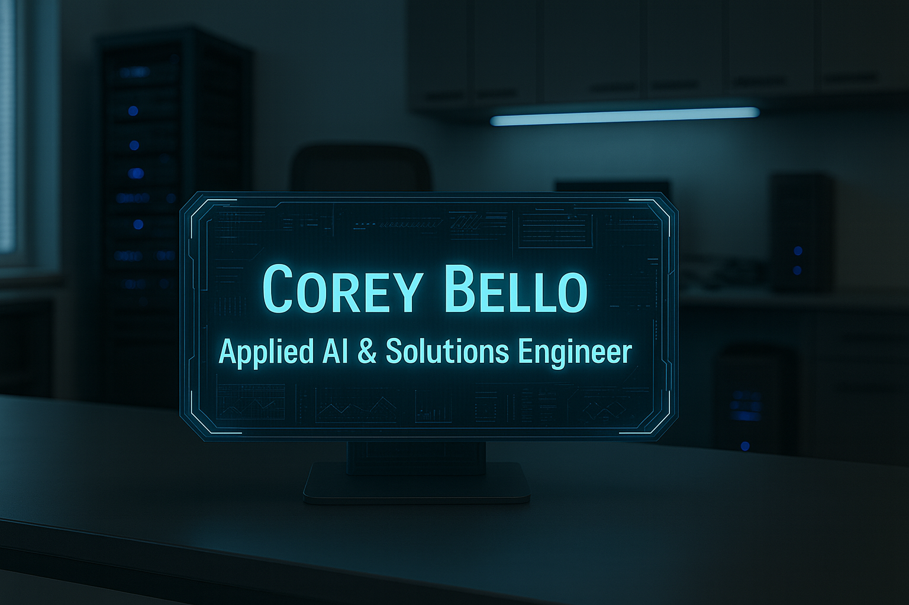

# Hi, I’m Corey 👋

I’m an **Applied AI & Solutions Engineer** bridging **AI R&D**, **systems integration**, and **end-to-end deployment**. With 9+ years of enterprise application support experience, I specialize in building **secure, high-performance AI systems** that modernize IT operations, accelerate service delivery, and operate in compliance-sensitive environments.

I hold an active **CJIS clearance** and am currently deploying **NotebookLM** and **RAG chatbot** solutions while completing my **B.S. in Artificial Intelligence** (4.0 GPA).

---

## 🎯 Current Technical Focus
- **Deploying AI Knowledge Management Systems** that process 2,000+ documents for instant, cited answers.
- **Developing RAG chatbot architectures** with vector databases, scheduled ingestion, and prompt catalogs.
- **Prototyping ITSM AI copilots** with human-in-the-loop approval, field pre-fill, and ticket triage automation.
- **Fine-tuning LLMs** (Mistral 7B, Gemma, Llama 3) via QLoRA for domain-specific enterprise use cases.
- **Building automation infrastructure** on Raspberry Pi and Mac Mini for persistent, edge-based AI workflows.
- **Planning and building a home lab** — converting existing hardware into a rack-based system, swapping the PC case to a server case, and setting up a dedicated home lab rack for scalable AI and automation experimentation.

---

## 🚀 Featured Projects

### [Enterprise Knowledgebase Management System (KBMS)](https://github.com/coreybello/enterprise-kbms)
- **Goal:** Reduce time-to-answer from ~15 min to ~2 min across 15 enterprise apps.
- **Stack:** Python, FastAPI, Postgres, Jobs API, Docker.
- **Impact:** Saved 150+ hours/month, improved first-contact resolution by 30%.

### [Enterprise RAG Chatbot *(Internal Testing)*](https://github.com/coreybello/enterprise-rag-chatbot)
- **Goal:** Deliver cited, templated answers from 2,000+ internal documents.
- **Stack:** Python, ChromaDB, Llama 3, Streamlit, Docker.
- **Status:** Internal testing with measurable accuracy and latency metrics.

### [ITSM AI Copilot *(Prototype)*](https://github.com/coreybello/itsm-ai-copilot)
- **Goal:** Automate ticket triage, suggest cited replies, and pre-fill ticket fields.
- **Stack:** Python microservices, RAG integration, Prompt Library.
- **Status:** Prototype ready; pilot planned.

---

## 🛠️ Technical Skills
**Languages:** Python, JavaScript, TypeScript, SQL, PowerShell, HTML/CSS  
**AI Frameworks:** PyTorch, TensorFlow, Scikit-learn, LangChain, Model Context Protocol (MCP), Prompt Engineering  
**Development:** API Development, Full-Stack Web Apps, Virtual Environments, n8n Automation  
**DevOps & Cloud:** Git, Docker, CI/CD Pipelines, Google Cloud Platform, ServiceNow  
**Methodologies:** Agile, DevOps, SDLC, Rapid Prototyping, Virtual Team Collaboration  
**Systems:** Linux, Ubuntu, WSL2, Raspberry Pi, Samba NAS

---

## 📈 GitHub Activity
  

---

## 🎓 Certifications & Education
**Certifications:** IBM (AI Product Manager, AI Developer, AI Engineering, Deep Learning, Generative AI Engineering) · Google (Generative AI Leader, Cybersecurity, Data Analytics, IT Support) · Anthropic (Intro to MCP, MCP: Advanced Topics, Claude Code in Action) · Vanderbilt (AI Agent Developer) · CompTIA A+ · Security+ (In Progress)  
**Full Certification List:** [View on my website →](https://www.coreybello.com/certifications)  
**Education:** Bachelor of Science in Artificial Intelligence, Strayer University — GPA: 4.0 — Expected 03/2026

---

## 💡 Career Alignment
While GitHub showcases my **developer and tech-enthusiast** side, my work is tightly aligned with my professional mission:  
**Designing and deploying secure, high-impact AI systems that transform IT operations and deliver measurable efficiency gains.**

**Target Roles:** Applied AI Engineer · AI/ML Engineer · AI Integration Specialist  
**Industries:** Aerospace · Defense · Government IT Modernization  
**Security:** U.S. Citizen · Eligible for Security Clearance

---

## 📬 Let’s Connect
  
